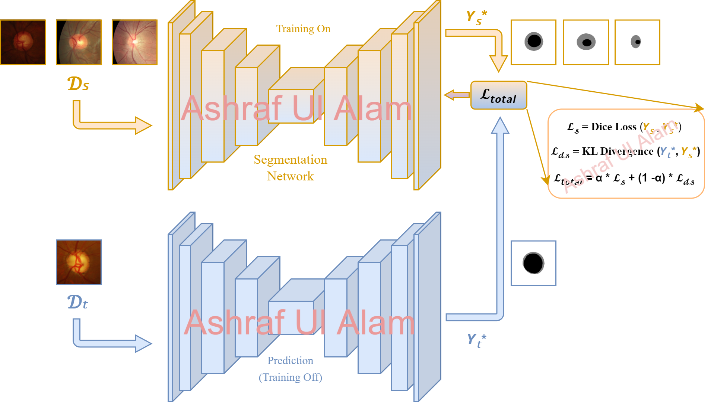

# Knowledge Distillation-based Unsupervised Domain Adaptation for Improved Medical Image Segmentation

## Overview

This repository provides a summary of the thesis titled **"Knowledge Distillation-based Unsupervised Domain Adaptation for Improved Medical Image Segmentation"**. The research focuses on leveraging knowledge distillation for unsupervised domain adaptation to enhance medical image segmentation across unseen target domains. The thesis addresses challenges in adapting models to new domains without requiring labeled data from those domains.

##Abstract

Medical image segmentation plays a critical role in computer-aided diagnosis and treatment planning. However, robust segmentation across diverse domains remains a challenge due to inherent variations in imaging modalities and anatomical structures. In this regard, a framework, Knowledge Distillation-based Unsupervised Domain Adaptation (KD-UDA), is proposed to enhance the performance of segmentation models on unseen target domains. The effectiveness of KD-UDA is extensively evaluated on Drishti-GS, RIM-ONE-R3, and REFUGE retinal datasets, as well as the BraTS2021 brain tumor MRI dataset. For retinal image segmentation, the framework demonstrates significant performance improvements across various models, including UNet, UNet with ResNet50 Backbone, and 2D Attention Enhanced Residual UNet (AERUNet), when adapted to unseen target domains. Notably, the approach achieves superior segmentation accuracy in both optic cup and optic disc regions compared to previous state-of-the-art methods, with the highest Dice Score of 87.74% for optic cup segmentation and 93.82% for optic disc segmentation in the target domain, increases of 6.68% and 4.94%, respectively, from the same 2D AERUNet model trained without KD-UDA. The 3D AERUNet model outperforms previous methods in segmentation accuracy and adaptability between T2 and FLAIR modalities on the BraTS2021 dataset, especially with histogram-matched images, which improve segmentation performance across target domains. The highest Dice Score for T2 to FLAIR adaptation is 82.14%, and FLAIR to T2 adaptation is 83.26%, an increase of 6.15% and 2.5%, respectively, over training without KD-UDA. Additionally, KD-UDA's superiority in adapting to unseen target domains while maintaining strong source domain performance is demonstrated through extensive comparisons with previous works. These findings suggest that KD-UDA could revolutionize medical image segmentation, improving diagnosis, treatment planning, and patient care in various medical specialties.

> **📝 Note:** This abstract is from my thesis book. For further details, feel free to contact me at ashrafamit9227@gmail.com.

## Key Contributions

1. **Datasets**:
   - **2D Datasets**: Utilized datasets such as **Drishti-GS, RIM-ONE-R3, REFUGE Source-1, and REFUGE Source-2**. These datasets provide pixel-level annotations for optic cup (OC) and optic disc (OD) in retinal images, captured using various scanners.
   - **3D Dataset**: Employed the **BraTS2021** dataset, including multi-parametric MRI scans in NIfTI format. Focused on T2 and FLAIR volumes for domain adaptation tasks.

2. **Image Processing Techniques**:
   - **2D Images**: Applied Contrast Limited Adaptive Histogram Equalization (CLAHE) to enhance contrast and brightness while preserving color information.
   - **3D Images**: Performed histogram matching to align pixel intensity distributions between source and target domains, thereby reducing domain shift.

3. **Model Architecture**:
   - **Attention-Enhanced Residual U-Net (AERUNet)**: Implemented both 2D and 3D versions of the AERUNet model. The 2D model integrates residual blocks and spatial attention mechanisms for improved feature extraction and segmentation accuracy in 2D images. The 3D model applies similar principles to multi-parametric MRI data, enhancing segmentation performance across 3D volumes.

4. **Domain Adaptation Framework**:
   - **Knowledge Distillation**: Utilizes knowledge transfer to improve segmentation performance by distilling knowledge from the source domain to the target domain. Incorporates source loss and domain shift loss, leveraging **Kullback-Leibler (KL) divergence for domain shift minimization**.
<!--
## Implementation Details

- **2D Image Processing**: Images and masks resized to (256, 256, 3) and (256, 256) respectively. CLAHE applied to Y channel of YCrCb color space for contrast enhancement.
- **3D Image Processing**: Cropped images from (240, 240, 155) to (140, 170, 155) to reduce background pixels. Histogram matching used to align pixel intensities.
-->
## Note

We are currently working on a research paper based on this project. Once the paper is published, we will upload and disclose the code associated with this project. 

## License

All content, including code and documentation, is protected by intellectual property rights. Unauthorized use or distribution of this material is prohibited.

## Contact

For more information, please contact [Ashraf Ul Alam](mailto:your.email@example.com).
